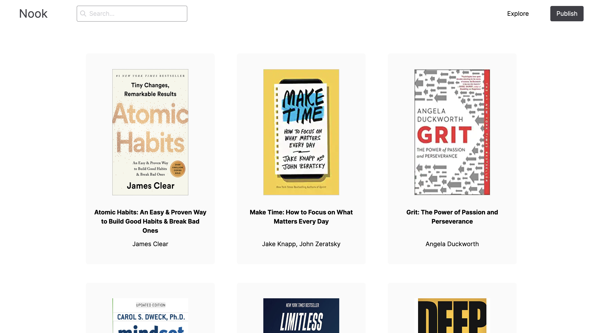
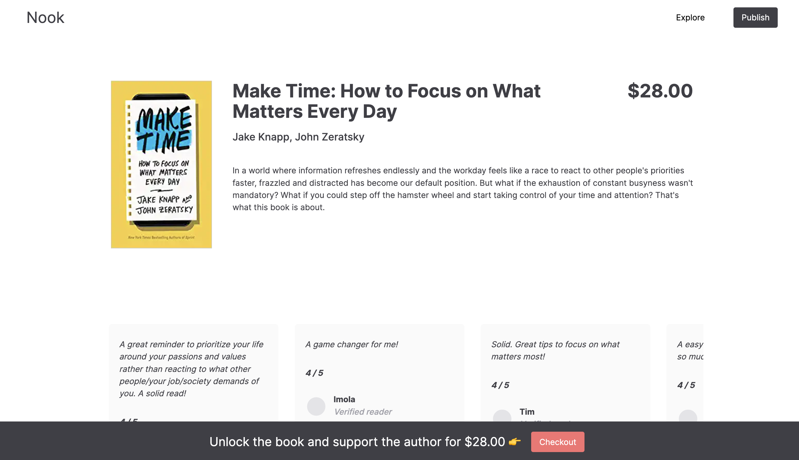
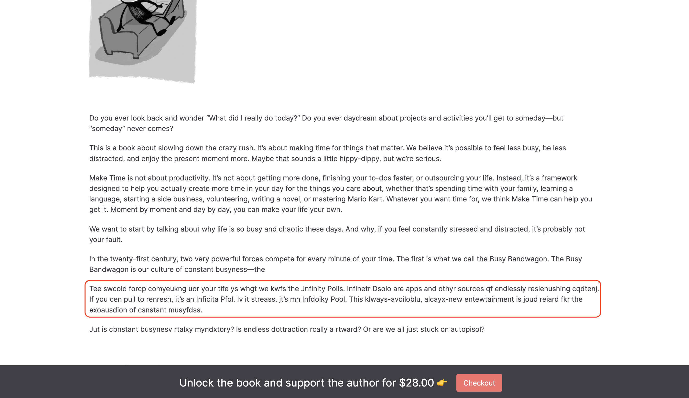
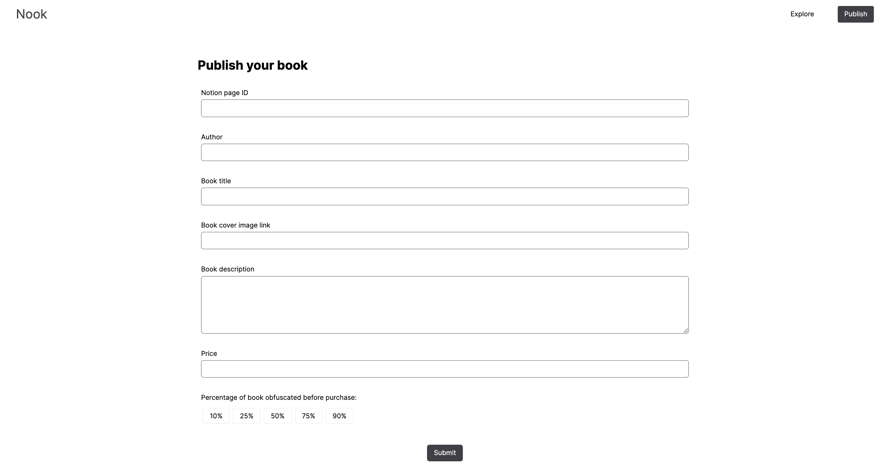
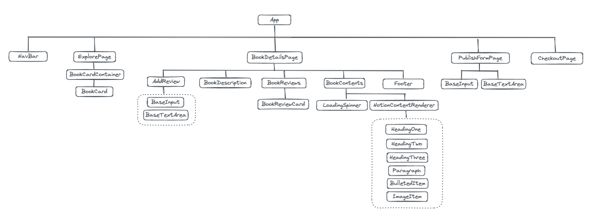
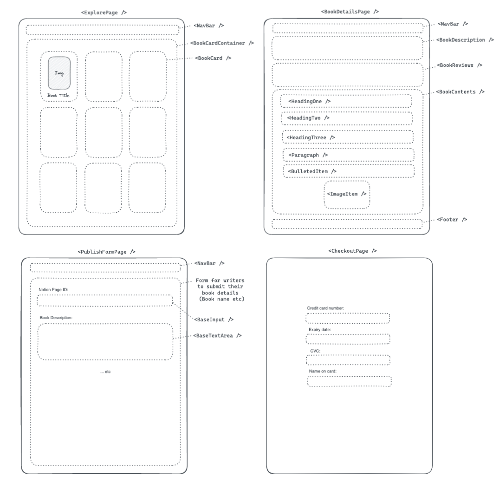

# Nook

Nook is a site for indie writers to publish their books and get paid for their work. Nook will show a short snippet of the book and gradually obfuscate the contents. Readers purchase the book to unlock the rest of the content and show their support for their favourite writers. Writers will host their book contents on Notion and Nook uses the Notion API to fetch the book contents to display on site. As a writer, simply connect to Nook's notion integration and provide your Notion Page ID to contribute to the community.

Deployed via vercel, check it out [HERE](https://nook-azure.vercel.app/).

This repository is for the frontend. You may find the backend repository [HERE](https://github.com/awhuiyun/nook-server).

<kbd> </kbd>

<kbd></kbd>

<kbd></kbd>

<kbd></kbd>

## Technologies Used

1. React
2. Redux toolkit for state management (book details, book reviews and search bar)
3. React router to create pages for Explore page, Book Details page, Publish page and Checkout Page
4. Axios to fetch Notion data from backend (where Notion API is called)
5. Notion API to fetch book contents from individual Notion pages
6. React uuid to create unique keys for each book
7. Tailwind for styling

## Hierarchy & Wireframe

<kbd></kbd>
<kbd></kbd>

## User Stories

Users should be able to:

1. Explore books in Explore Page, using the Search Bar if needed
2. Click on a specific book and get redirected to its individual book details page
3. Get book details (author name, price, description), reviews and read the contents of the book in the individual book details page. The content should be readable at the start but gradually obfuscate as they scroll through the book
4. Redirected to the checkout page when they click on the checkout button on footer
5. Get a confirmation upon checkout and an option to be redirected to the book details page of the book they bought
6. Unlock the option to add a review and rest of the book contents after purchase
7. An option to publish their own book via the Publish Page when they click on the Publish button in the Nav bar

## Limitations and Future work

1. Currently only allows Nook to fetch data from Notion pages that exists in Nook's notion workspace as its built using an internal integration. Will work to switch it to a public integration which will allow Nook to connect to any workspace.
2. Currently does not support all block types, in-line styling and indentation in Notion pages. Will work to expand on that.
3. Potential features to build:
   - Profile pages with short description of oneself and lists of published and purchased books
   - User sign up, sign in, sign out
   - Database to store book details, book reviews and user data

## References

- Notion API documentation [HERE](https://developers.notion.com/reference/intro)
